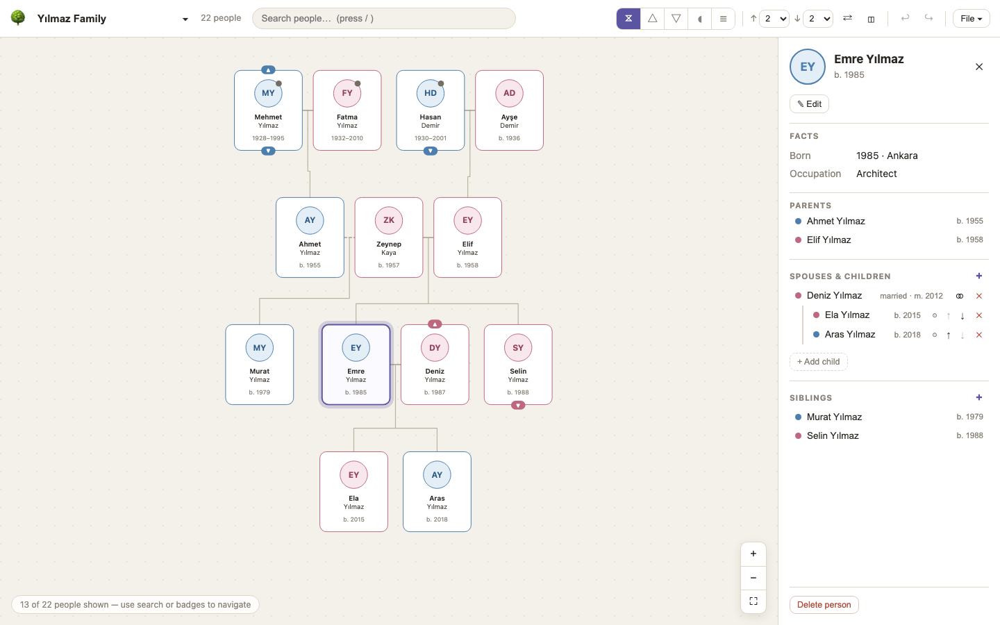
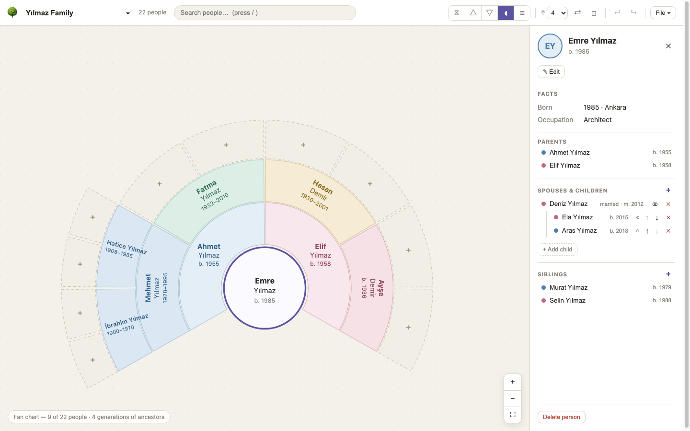
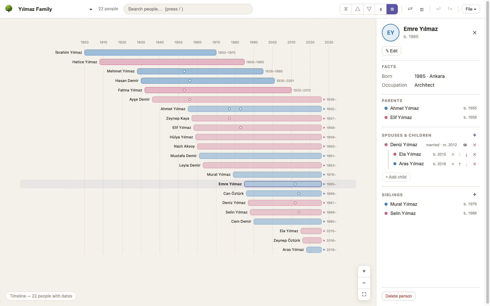
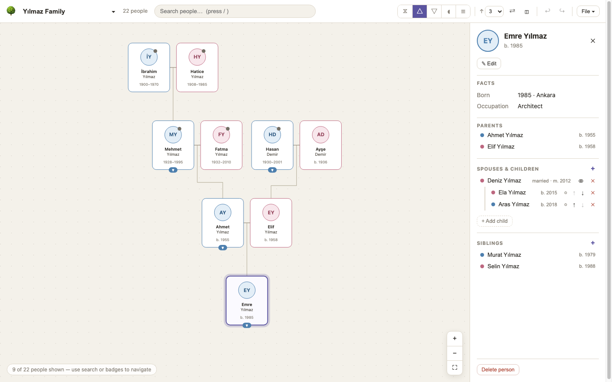

<div align="center">

# 🌳 Family Tree

**A fully client-side family tree application with a hand-built SVG layout engine.**
No chart library, no backend — your data never leaves the browser.

[](https://github.com/girginomer10/family-tree/actions/workflows/ci.yml)
[](https://github.com/girginomer10/family-tree/actions/workflows/deploy.yml)
[](LICENSE)


**[▶ Live demo](https://girginomer10.github.io/family-tree/)** — loads a 22-person sample family



</div>

## Features

- **Five chart views**: Hourglass (ancestors + descendants + siblings), Pedigree (blood
  line only), Descendants, a branch-colored **Fan chart** with in-place "+ add ancestor"
  sectors, and a **Timeline** of lifespan bars with marriage markers.
- **Real genealogy semantics**: the data model is *Person + Union* (GEDCOM INDI/FAM
  style), so multiple marriages, half-siblings, unknown parents, divorced couples
  (dashed line) and adopted/step/foster children (dashed stubs, GEDCOM `PEDI`) all
  work correctly — no special-case hacks.
- **Relationship calculator**: proper kinship terms ("half-brother", "first cousin once
  removed", "husband of sister"), plus a clickable connection chain for distant pairs.
  The side panel always shows how the selected person relates to the focus person.
- **Full editing**: add parent / spouse / child / sibling (or link existing people),
  fuzzy dates (`abt. 1890`), photo upload (auto-downscaled to portable data URLs),
  marriage details, sibling reordering, unlink/delete — all with undo/redo (⌘Z).
- **Statistics dashboard**: lifespans, births per decade, top surnames & birth places.
- **Multiple trees** with instant switching; imports always land in a new tree.
- **Import/Export**: GEDCOM 5.5.1 (round-trip tested, interops with Gramps, webtrees,
  Ancestry…), JSON, and the chart itself as SVG or PNG.
- **Navigation**: pan/zoom canvas, click to select, double-click to re-center,
  `/` for search, ▲/▼ badges reveal relatives outside the rendered depth.

## Gallery

| Fan chart | Timeline |
| :---: | :---: |
|  |  |

| Pedigree | Hourglass |
| :---: | :---: |
|  |  |

## Quick start

```bash
npm install
npm run dev        # start the app at http://localhost:5173
npm run build      # type-check + production build
npm run smoke      # ~160 logic checks: model, layouts, kinship, GEDCOM round-trip
```

## Architecture

```
src/
  types.ts               Data model: Person + Union (GEDCOM INDI/FAM style) + helpers
  model/
    mutations.ts         Pure edit operations; every one keeps person<->union refs bidirectional
    queries.ts           Traversals (parents/spouses/children/siblings), search, validate()
    kinship.ts           Relationship calculator (common-ancestor terms, in-law composition, BFS chain)
    stats.ts             Tree statistics (lifespans, decades, top names/places)
  layout/
    layout.ts            Tree layout engine, 3 modes: hourglass / pedigree / descendants
    fan.ts               Ancestor fan chart geometry (ahnentafel slots -> SVG sectors)
    timeline.ts          Lifespan-bar timeline layout (decade grid, marriage markers)
  gedcom/gedcom.ts       GEDCOM 5.5.1 import (FAM records authoritative) and export
  store/useTreeStore.ts  Multi-tree store: tree index + per-tree localStorage autosave,
                         per-session undo/redo history
  data/sample.ts         Demo family
  utils/files.ts         Download/read files, SVG serialization, SVG->PNG, photo downscaling
  components/            Toolbar, ZoomCanvas (shared pan/zoom), TreeCanvas, FanChartView,
                         TimelineView, PersonCard, Sidebar, person/union/relationship/stats modals
scripts/smoke.ts         Headless checks: model invariants, layout overlap tests, GEDCOM round-trip
```

### Data model

Two entities, mirroring GEDCOM's INDI/FAM — the only model that cleanly expresses
remarriage, half-siblings, and unknown parents:

- `Person` — names, gender, fuzzy birth/death events, plus back-references
  `unionsAsPartner[]` (~FAMS) and `unionAsChild` (~FAMC).
- `Union` — up to 2 `partners`, ordered `children` (with per-child birth/adopted/step/
  foster types), status, marriage/divorce events. A union with one partner = the other
  parent is unknown.

`validate()` checks referential integrity; every mutation and import maintains it.

### Layout engine (`src/layout/layout.ts`)

A tidy-tree variant over "blocks" (anchor person + spouse cards laid side by side):

1. The root row is the focus's parents — anchored on the parent with the most unions so
   step-parents and half-siblings appear. Only the focus expands downward; siblings stay
   leaf cards.
2. Descendant side: post-order walk computes per-level `[left,right]` extents; subtrees
   are merged with per-level contour collision shifts; parents are centered over their
   children's connection points (union marriage midpoints).
3. Ancestor side: a pedigree tree of couple blocks hangs over each parent card, laid out
   independently with the same walk and glued at x=0 (shared root block).
4. Connectors are orthogonal buses: marriage midpoint → drop to a lane between the
   generation rows → horizontal bus → stubs into each child's card top. Multiple
   child-bearing unions get staggered lanes. People reached twice (pedigree collapse)
   render once plus dashed "see elsewhere" stub cards.

The engine is a pure function returning `{cards, links, bounds}`, so it is unit-testable
and renderer-agnostic.

### GEDCOM

Import parses the line/level structure into a node tree, folds `CONC/CONT`, builds
persons from `INDI` and unions from `FAM`, then rebuilds all person-side pointers from
the FAM records (authoritative), collecting warnings instead of throwing. Export writes
GEDCOM 5.5.1 with `CHAR UTF-8`, sequential `@I#@/@F#@` xrefs, HUSB/WIFE slots assigned
by gender, and `PEDI` for non-birth children. Round-trip is covered in `scripts/smoke.ts`.

## Notes & roadmap

- Aunts/uncles/cousins are intentionally outside hourglass scope — badges + refocus
  reach them. A "descendants of ancestors" toggle would widen the view.
- Ideas: map of life events, fan-chart data-completeness overlay, PDF export,
  drag-to-reorder siblings, duplicate-person detection across imports.
- PNG export rasterizes the live SVG; photos from remote URLs taint the canvas and make
  it fail (uploaded data-URL photos are safe) — the app shows a hint when that happens.

## License

[MIT](LICENSE) © 2026 Ömer Girgin
